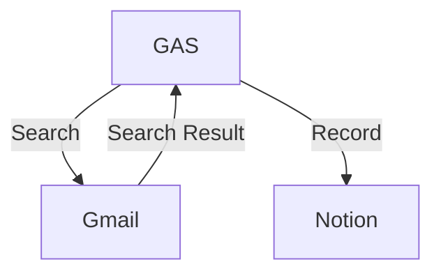

# Gmail to Notion

定期的にGmailを検索し、検索結果をNotionに記録するGoogle Apps Script.

Search Gmail periodically and record the search results in Notion.



## ユースケース

- 特定のラベルをつけたメールを検索し、その結果をNotionに記録する
- Record the search results of emails with specific labels in Notion

## Setup

1. [clasp](https://github.com/google/clasp)でGoogle Apps Scriptのプロジェクトを作成する

```bash
npm ci
npx clasp login
npx clasp create --rootDir ./dist
cp appsscript.json ./dist/
touch .env
```

2. `.env`ファイルを作成し、以下のように設定する
   - [`op run`](https://developer.1password.com/docs/cli/reference/commands/run)で読み込んで利用することを想定している

```
# Search Query
SEARCH_QUERY="{label:A OR label:B}"
# Notion Token
NOTION_TOKEN="secret_XXXXXXXXXXX"
NOTION_DATABASE_ID="xxxxxxxxxxxxxxxxxxxxx"
NOTION_PROJECTS_ID="xxxxxxxxxxxxxxxxxxxxx"
```

3. `npm run deploy`でデプロイする

```sh
npm run deploy
```

## 仕組み

- 検索して、その結果をNotionに記録
- 一度記録したものは、再度記録しない

## Notionのデータベース構造

- [src/notion.ts](./src/notion.ts)を参照して変更する
- プロパティ
  - タスク名
  - Projects
  - URL

## License

MIT
